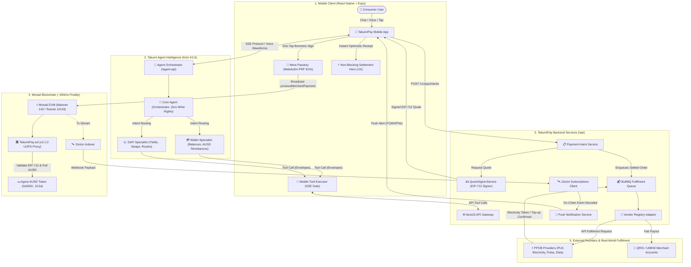

# TakumiPay — Metropolis Monad Hackathon 2026

> **Consumer Cross-Border Remittance & Merchant Settlement on Monad**  
> *Seedless onboarding with Mera passkeys, sub-second settlement in Agora AUSD, and AI-driven remittance via Takumi Agent.*

- **Team:** Planckify Labs
- **Track Entered:** Track 02 — Consumer Products & Payments
- **Technical Demo (3 min):** [Watch on YouTube](https://youtu.be/5kS-HD6G_bo)
- **Live Preview APK (Android):** [Download on Google Drive](https://drive.google.com/file/d/1Z9yxv1afO5y32r0b_qIRSNtPM52lS1RN/view?usp=sharing)
- **Targeted Sponsor Bounties:**
  - **Mera Bounty:** Passkey account layer as the entire onboarding experience (zero seed phrase)
  - **Agora Bounty:** End-to-end AUSD stablecoin integration on Monad
  - **Kimi Bounty:** Takumi Agent powered by Kimi K2.6 for conversational remittance
- **License:** [GNU General Public License v3.0 (GPLv3)](./LICENSE)

> 📱 **Notice for Judges & Testers**: Please install and test the Preview APK on a **physical device** (Android phone with biometric support such as fingerprint or Face Unlock). Mera's passkey key derivation relies on the **WebAuthn PRF (Pseudo-Random Function) extension** and platform biometric authenticators (Google Credential Manager). Android emulators typically lack biometric enrollment and PRF extension support in their virtual Google Play Services environment, which will prevent the passkey onboarding ceremony from completing.

---

## Overview

Cross-border remittance is the quintessential consumer application where on-chain rails offer an undeniable real-world advantage. Migrant workers sending money home to Southeast Asia face multi-day delays, 5–10% hidden FX fees, and the friction of physical cash pickup.

TakumiPay redefines this experience by removing every point of crypto friction:
1. **Passkey-First Onboarding (Mera):** Users sign up in seconds using Face ID or Touch ID. No seed phrase, no private keys to copy, and no "Connect Wallet" modal.
2. **Sub-Second Finality (Monad):** Payments settle in ~600ms on Monad with sub-cent gas fees.
3. **Purchasing Power Preservation (Agora AUSD):** Funds move in Agora AUSD (`0x00000000eFE302BEAA2b3e6e1b18d08D69a9012a`), backed 1:1 by high-quality US liquid reserves.
4. **Spendable Anywhere (QRIS / UMKM):** The recipient doesn't just receive tokens; they can immediately spend them at over 44M+ QRIS/UMKM merchants across Indonesia without manually off-ramping.
5. **Conversational Remittance (Takumi Agent):** Powered by Kimi K2.6, users can send funds by simply typing or speaking: *"Send $50 to my mom in Jakarta"*.

---

## End-to-End System Architecture

The following diagram illustrates how TakumiPay's multi-agent intelligence, backend microservices, Monad smart contracts, and real-world payment rails communicate end-to-end:



### Architectural Highlights

1. **Takumi Agent Specialist Model**:
   - **Core Agent**: Acts strictly as the orchestrator. It manages session context, parses natural-language user intent with Kimi K2.6, and routes tasks to specialized agents without holding write permissions.
   - **Wallet Specialist & DeFi Specialist**: Handle domain-specific capabilities (e.g. `send_token`, `get_wallet_assets`). Tool calls are dispatched over SSE envelopes to the mobile client, enforcing **Wallet Context Isolation** (intents execute against the intent wallet, not the active UI wallet).
2. **End-to-End QRIS & PPOB Bill Settlement**:
   - The user scans a QRIS merchant code or selects a utility bill (PLN electricity token, mobile pulsa/data).
   - The mobile app requests an intent from the backend API, where `QuoteSignerService` issues an EIP-712 cryptographic quote signed by `backendSigner`.
   - The user signs the transaction with their **Mera Passkey (WebAuthn PRF)** via Face ID or fingerprint.
   - The transaction broadcasts to Monad, calling `processMerchantPayment` on `TakumiPay.sol` (v2.1.0 UUPS Proxy), transferring Agora AUSD in ~600ms.
   - The UI immediately renders a non-blocking settlement timeline (`Preparing` → `Confirming` → `Paid`).
3. **PPOB Fulfilment & QRIS Merchant Disbursement**:
   - Once the Monad transaction confirms, `FulfilmentService` routes the settled order through `VendorRegistry` to the PPOB Provider (e.g. VCGamers/Acme PPOB) to deliver electricity prepaid tokens or mobile pulsa in real-time.
   - For merchant payments, the equivalent fiat amount is disbursed directly to the merchant's local bank or e-wallet account (GoPay, OVO, DANA).
4. **Real-Time Indexing & Push Notifications (Zerion Integration)**:
   - Monad on-chain activity is indexed via Zerion.
   - Zerion webhook subscriptions (`ZerionSubscriptionsClient`) stream decoded transaction events back to TakumiPay's backend, triggering instant push notifications to the user via FCM/APNs.

---

## Monad On-Chain Deployments & Smart Contracts

TakumiPay is deployed live on both **Monad Mainnet** (for the real AUSD remittance leg) and **Monad Testnet** (for the QRIS merchant-spend verification rail).

### 1. Monad Mainnet (`chainId: 143`) — Production Remittance Rail

| Component | Detail | Address / Hash |
|---|---|---|
| **TakumiPay Proxy (UUPS)** | Main Treasury & Settlement Contract (v2.1.0) | [`0x479B0843C3e0627f36551660506dEd5b349Fa968`](https://monadvision.com/address/0x479B0843C3e0627f36551660506dEd5b349Fa968) |
| **Implementation** | `TakumiPay.sol` logic implementation | `0x1aC593085Fa34c651E805085da4b2cabAC676F99` |
| **Proxy Deploy Tx** | Contract deployment transaction | `0x0c50d974055f91c9b093d45026d4ab214f7b0f67e30627976f8bc66f6128f8c7` |
| **Implementation Deploy Tx** | Implementation contract deploy | `0x051d16f8b67b71945231f82550060a565496883a02f95404e5c4152b01f83525` |
| **Primary Token (Agora AUSD)** | Real Agora AUSD (ERC-20, 6 decimals) | [`0x00000000eFE302BEAA2b3e6e1b18d08D69a9012a`](https://monadvision.com/address/0x00000000eFE302BEAA2b3e6e1b18d08D69a9012a) |
| **Enable AUSD Tx** | `addAllowedPaymentToken(AUSD)` | `0x8d12ec7d42afd22e9f436a0832fb1814ea047f7e7cf9dbcdd7b6feafbc37d0a2` |
| **Native Gas** | Monad native gas asset | `MON` (18 decimals) |
| **Backend Signer** | Authorized merchant quote signer | `0x299E4E56e9F05A21414A62479DA1514C20aA61e8` |

### 2. Monad Testnet (`chainId: 10143`) — Merchant Spend Verification Rail

| Component | Detail | Address / Hash |
|---|---|---|
| **TakumiPay Proxy (UUPS)** | Main Treasury & Settlement Contract (v2.1.0) | [`0x9EEC5aD4FC092fD468A8114007e541238F4Ba5ee`](https://testnet.monadvision.com/address/0x9EEC5aD4FC092fD468A8114007e541238F4Ba5ee) |
| **Implementation** | `TakumiPay.sol` logic implementation | `0xbB074ED383dA5C99756D72b62f7Fdff97A8c9022` |
| **Proxy Deploy Tx** | Contract deployment transaction | `0x6eed45f5b5bac2652706f8f7bd765887dd278d8df0a54edd1476f8578b4386d6` |
| **Implementation Deploy Tx** | Implementation contract deploy | `0x76b3f2c44af2fd9ba31cb9d81eb2f79eb316d2effbc5e2d04649c718c3234e0e` |
| **Open-Mint MockAUSD** | 6-decimal testnet stand-in (`src/MockAUSD.sol`) | [`0x1aC593085Fa34c651E805085da4b2cabAC676F99`](https://testnet.monadvision.com/address/0x1aC593085Fa34c651E805085da4b2cabAC676F99) |
| **MockAUSD Deploy Tx** | Mock contract deployment | `0xdca51260a5709ccbadbd39f86dbd2e7ef6046647d9ff2e3a64882dacf1f4aa01` |
| **MockAUSD Initial Mint Tx** | Initial mint transaction (1M AUSD) | `0x2f1fc4a16acd3deca75e40f3695421799a46bb807d2b52fa028398f434726605` |

*(Note on testnet AUSD: Agora's testnet AUSD has a permissioned mint with no public faucet. For open merchant-spend testing on testnet, our open-mint `MockAUSD` (with identical 6 decimals) is allowlisted on `TakumiPay`, while the mainnet remittance rail uses the real Agora AUSD).*

---

## Metropolis Hackathon Build & Originality Disclosure

*(Mandatory disclosure under Section 4.1 Clause 4 of Metropolis Hackathon Rules)*

### 1. Pre-Existing Foundation (Prior to September 1, 2026)
Foundational mobile UI design system, cryptographic signing utilities, and core payment gateway components originated prior to the hackathon.

### 2. Substantial New Work Built During Hackathon Window (September 18 – September 26, 2026)
*The entire consumer remittance, passkey, and settlement interface was engineered specifically for the Monad ecosystem:*
- **Dedicated Monad Architecture & Streamlined UX (`services/walletKit/chainSupport.ts`):**
  Engineered a single-ecosystem consumer flow centered on Monad Mainnet (`143`) and Testnet (`10143`), eliminating network dropdowns and configuration friction for everyday consumers.


- **Mera Passkey Account Layer (`services/walletKit/evm/mera/`, `hooks/usePasskeyOnboarding.ts`, `app/login.tsx`):**
  Engineered PRF-derived secp256k1 EOA authentication using WebAuthn. Replaced all legacy seed-phrase onboarding with a single biometric "Continue with Face ID / Fingerprint" tap.
- **Monad & AUSD Integration (`services/chains/evm/monad.ts`):**
  Added Monad Mainnet (`143`) and Testnet (`10143`) support, Agora AUSD token integration, deterministic gas cap rules for Monad execution, and balance feeds.
- **TakumiPay 2.1.0 Monad Deployment (`TakumiPay.sol`):**
  Deployed and initialized UUPS proxy contracts on both Monad Mainnet (`0x479B0843C3e0627f36551660506dEd5b349Fa968`) and Monad Testnet (`0x9EEC5aD4FC092fD468A8114007e541238F4Ba5ee`), allowlisting AUSD with sweep cap governance.
- **Non-Blocking Settlement UI (`components/pay-merchant/PaymentProgressHero.tsx`, `services/nanopay/pathOnchainSettlement.ts`):**
  Built an optimistic settlement timeline (`Preparing` → `Confirming` → `Paid`) that displays immediate visual receipt upon transaction broadcast while asynchronously confirming on Monad.
- **Consumer Error Sanitization (`services/errors/sendErrors.ts`, `services/nanopay/preflight.ts`):**
  Replaced raw RPC/EVM revert messages with friendly, actionable copy tailored for non-crypto consumers.
- **Takumi Agent Voice & Remittance Extensions (`components/home/TakumiAgent/`):**
  Integrated Kimi K2.6 natural-language intent parsing to resolve recipients, chains, and AUSD transfers with visual voice waveforms.

### 3. AI Coding Tools Disclosure
As permitted by Hackathon Rule 4.1, generative AI coding assistants (Claude Sonnet/Opus and Google Gemini) were utilized for drafting, refactoring, and test generation.

---

## Architecture Overview

```
mobile-app/
├── app/
│   ├── login.tsx                   # Biometric passkey-only onboarding
│   ├── pay-merchant.tsx            # Merchant payment flow
│   └── send.tsx                    # Consumer AUSD transfer screen
├── components/
│   ├── home/TakumiAgent/           # Kimi-powered AI assistant & voice waves
│   └── pay-merchant/
│       └── PaymentProgressHero.tsx # Optimistic settlement timeline
├── hooks/
│   └── usePasskeyOnboarding.ts     # Mera WebAuthn/PRF ceremony orchestrator
└── services/
    ├── chains/evm/monad.ts         # Monad chain & Agora AUSD constants
    ├── errors/sendErrors.ts        # User-friendly error sanitization
    └── walletKit/
        ├── chainSupport.ts         # Monad network support filter
        └── evm/mera/               # Passkey EOA derivation & credential storage
```

---

## Quick Start & Verification

### Testing the Standalone Preview APK (Direct Install)
If you prefer not to build from source, you can install the pre-built APK directly onto an Android device:
- **Download APK:** [Google Drive Link](https://drive.google.com/file/d/1Z9yxv1afO5y32r0b_qIRSNtPM52lS1RN/view?usp=sharing)
- **Important**: Test on a **physical Android phone** with fingerprint/face biometric hardware. Emulators generally lack biometric enrollment and WebAuthn PRF extension support in virtual Google Play Services, which will prevent passkey key derivation.

---

### Building & Running from Source

#### Prerequisites
- Node.js 20+
- `pnpm` (v10 or v11)
- Expo CLI

### Setup
```bash
# Clone the repository
git clone https://github.com/Planckify-Labs/monad-submission-mobile-app.git
cd monad-submission-mobile-app

# Install dependencies
pnpm install

# Run TypeScript and architecture conformance checks
pnpm check:syntax
pnpm check:chains

# Run unit and integration tests
pnpm test
```

### Running Locally
```bash
# Start Expo development server
pnpm start

# Run on Android emulator or connected device
pnpm android

# Run on iOS simulator or device
pnpm ios
```

---

## Open Source License

This project is licensed under the **GNU General Public License v3.0 (GPLv3)**. See the [LICENSE](./LICENSE) file for the full license text.
